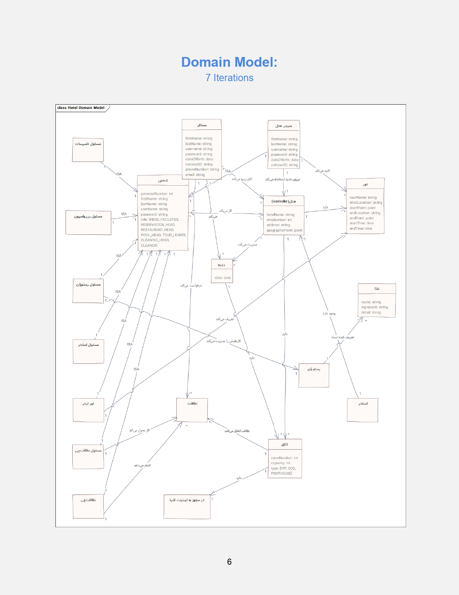

### Hotel-Reservation-system

 

This project is designed and implemented for the software engineering course of Shiraz University

 

This project contains the topics below:

- Data Flow Diagram level 0
- Data Flow Diagram level 1
- Domain Model
- SSD
- Precondition & Postcondition
- Class Diagram
- Sequence Diagram
- Communication Diagram
- Glossary
- Startup

 

